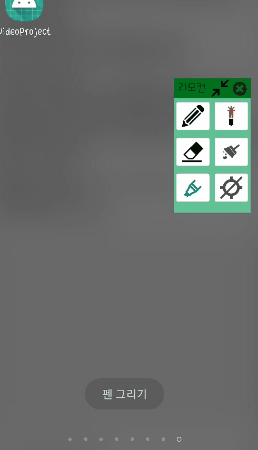
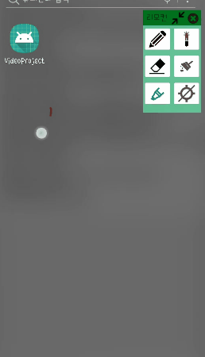
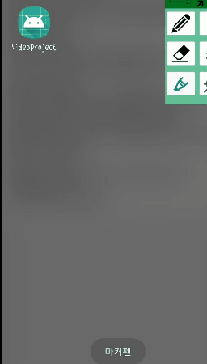
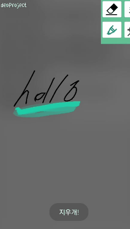
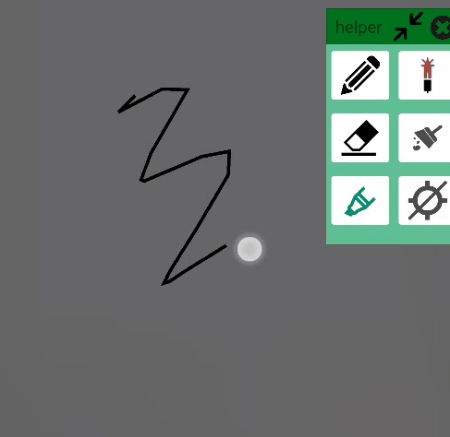

# ClassMate

1:1 과외를 하기 위한 동영상 스트리밍 어플리케이션 팀 프로젝트의 일부 코드입니다. 
(adaptive streaming, screen drawing service) 

동영상 링크: https://www.youtube.com/watch?v=RMkTWNjY1Vc 
화상 통화 연결 이후 화면 미러링, screen drawing service 시연, 웹서버에 업로드된 비디오 재생 및 네트워크 환경에 따른 adaptive streaming 순서로 진행됩니다. 
 
## 사용 기술
- 언어: Java, PHP, JavaScript
- 운영체제: Android, Ubuntu
- 웹서버: Apache
- 데이터베이스: MySQL
- 프로토콜: HTTP, Mpeg-DASH
- 주요 라이브러리/API: MediaProjection / ExoPlayer / Glide  / MPAndroidChart

## 기능 설명

### 네트워크 환경에 따른 adaptive streaming
  
화면 상단에는 동영상 플레이어, 하단에는 네트워크 세기 그래프가 있습니다. 
네트워크 환경에 따라 적절한 화질의 동영상을 제공합니다. 

### screen drawing service
screen drawing service를 이용하여 화면에 여러 가지 조작을 할 수 있습니다.
#### 펜, 레이저 포인터, 마커 펜
   
<strong>펜</strong>을 이용하여 화면에 그림을 그릴 수 있습니다. 
<strong>레이저 포인터</strong>를 이용하여 강조할 수 있습니다. 화면에서 손가락을 떼면 포인터가 사라집니다. 
<strong>마커 펜</strong>을 이용하여 강조할 수 있습니다. 오래 누르고 있을수록 짙어집니다. 

#### 지우개, 클리어
  
<strong>지우개</strong>를 이용하여 그림을 지울 수 있습니다. 
<strong>클리어</strong> 버튼을 누르면 화면에 그려진 모든 그림을 지울 수 있습니다. 

#### 포커스 오프, 최소화
  
<strong>포커스 오프</strong> 버튼을 누르면 그림을 두고 화면 조작을 할 수 있습니다. 
<strong>최소화</strong> 버튼을 누르면 리모콘의 크기를 줄일 수 있습니다. 다시 한번 누르면 원래 크기로 돌아옵니다. 
